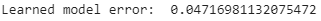
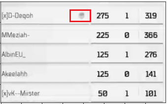

# Game score recognition

# 1.Introduction

The goal is to find and extract game results and statistics from the scoreboard.
The game is a first person online shooter "Call of Duty Black Ops 4". As input
we have an image with a scoreboard. As output there should be text with a score
and statistics of two teams.

This task divided into two stages:

1.  Scene detection. To locate segments with target data(text) on image.

2.  Text extraction. To recognize text in segments on the first stage. These two
    tasks are solved separately and each of them has its own model and
    implementation.

# 2.Scene detection

## 2.1 Preparing a dataset

As mentioned earlier, the single element of data is an image with a scoreboard
from an FPS game.

The image has four segments to detect. Two of them for the score of two teams,
last two of them - for statistics. The dataset consists of 80 images. It was
divided into train, test and validation parts. Train part has 40 images, test
part - 10 images, validation part - 30 images. The training dataset is used to
train a segmentation model, test dataset is used for testing a model during
training(on each training cycle), validation part is used for testing of the
learned model. The screens were collected from videos found on game streaming
platform Twitch.

The second step is a creating of markup for the collected images. Labels is used
to get an information about the segments(classes) that should be detected by
model in this task. The image with a markup looks like this:

The labeled areas also called bounding boxes. The markup was created with COCO
annotator tool. The result of labeling is a JSON-file with an information about
all images of dataset and segments(names of images, coordinates of bounding
boxes, etc.)

## 2.2 Data presentation

In the program, the images are presented as arrays of integers. At first, every
image is a matrix with dimensions 1366x768x3, where 1366 is a width of image,
768 is a height of image and 3 is a number of channels in RGB image(red, green
and blue channels). Every integer in these matrices is a value in range of 0-255
and means a brightness of image pixel(smaller value - darker pixel, bigger value
- brighter pixel). Secondly, all images are converted into grayscale format to
reduce the number of channels from 3 to 1. Range of values in matrices is still
0-255, but now it is a range between black(0) and white(255) colors. It is done
for more convenient creation of an image mask.

Image mask is a 2-dimensional matrix with original image dimensions. Elements of
the matrix are integers in range of 0-(number_of_classes - 1). These integers
show an accessory of every pixel to some class(segment of image) that the model
has to predict. An image and corresponding mask look like this:

In case of game score recognition task, there are four classes, corresponding to
the four segments mentioned earlier, and one additional class for the background
pixels that do not match to any of the segments.

Before the feeding images and masks to the model(model will be explained later),
masks have to be transformed into the binary mask. It is a matrix where number
of channels is equal to the number of predicted classes. Elements of the matrix
are integers with values of 0 or 1. 0 means that the determined pixel doesn't
match to class, 1 means that determined pixel matches to class.

## 2.3 Data augmentation

Data augmentation is a strategy that enables significant increasing of the
diversity of data available for training models, without actually collecting new
data. It is needed, because the deep learning models(in this case, deep learning
model is used) can reach higher level of performance with bigger amounts of
data. Data augmentation techniques such as cropping, padding, and horizontal
flipping are commonly used to train large neural networks. Since the training
dataset for score recognition task consists of only 40 images, it is recommended
to use data augmentation to increase the diversity of the data. In this work,
data augmentation is provided with Keras tools, especially ImageDataGenerator.
It is a class that defines a number of augmentation parameters and performs
creating new data corresponding to these parameters. ImageDataGenerator class
takes two parameters:

1.  Preprocessing function. Function provides changes to input data after
    augmentation.

2.  Data generation arguments. Arguments determine changes to augmented data. It
    can be a range of shifts, rotation, zoom, brightness, existence or absence
    of image flips etc.

Now there is a need to create a DirectoryIterator object to get the data(images
and corresponding masks) from drive and perform augmentation with them. This
could be done with a flow_from_directory function. It has additional arguments
for the augmentation process. The most important of them is TARGET_SIZE(it
determines the size of generated images and masks), BATCH_SIZE(it determines how
many images and masks fed to model in one learning cycle). In our case, the
TARGET_SIZE is 256x256(changed from 1366x768) and BATCH_SIZE is 5. Choice of
target size argument based on model performance(time spent on training) and
model architecture(will be explained further).

Example of original image, changed image and corresponding masks look like this:

## 2.4 Model

In this case, the segmentation model is a Convolutional Neural Network named
UNet. As input the model gets an image matrix, as output it gives a segmentation
map(mask).

The main idea behind CNN is to learn the feature mapping of an image and exploit
it to make more nuanced feature mapping. This works well in classification
problems as the image is converted into a vector which is used further for
classification. But in image segmentation, we not only need to convert the
feature map into a vector but also reconstruct an image from this vector. This
is a mammoth task because it’s a lot tougher to convert a vector into an image
than vice versa. The whole idea of UNet revolves around this problem.

While converting an image into a vector, we already learned the feature mapping
of the image so why not use the same mapping to convert it again to image. This
is the recipe behind UNet. Use the same feature maps that are used for
contraction to expand a vector to a segmented image. This would preserve the
structural integrity of the image which would reduce distortion enormously.

Here is UNet architecture:

UNet model has a several components which determine her architecture(partially),
output, and learning parameters:

1.  Backbone. The network that extracts the feature map from the input image.
    According to this feature map, U-net is able to extract the patterns from an
    image(beginning from straight lines and ending with complex objects). In
    this case, the backbone is Residual Convolutional Neural Network ‘resnet34’.

2.  Number of classes. Number of segments to predict. There are 5 classes to
    predict in game score recognition problem(2 score segments, 2 statistic
    segments and background).

3.  Activation function. Activation functions are mathematical equations that
    determine the output of a neural network. The function is attached to each
    neuron in the network, and determines whether it should be activated
    (“fired”) or not, based on whether each neuron’s input is relevant for the
    model’s prediction. Activation functions also help normalize the output of
    each neuron to a range between 1 and 0 or between -1 and 1.  
    The UNet activation function is sigmoid.

4.  Encoder weights. Pre-trained weights for the backbone model.

5.  Learning rate. A real value that controls changing of model weights during
    the learning process.

6.  Optimizer. Function that optimizes the learning process of segmentation
    model. In details, it reduces fluctuations during the process of stochastic
    gradient descent. For more details, see the source

7.  Loss function. In our case, loss function is the Binary Cross-Entropy
    Jaccard Loss.

8.  Callback function. It is another way to optimize the learning process.
    Callback function can affect some learning parameters for more efficient
    model performance. In this case, callback function reduces learning rate
    when a metric has stopped improving.

An intersection_over_union(iou) score is used as a metric for validation of the
model. It is a value that means a ratio of area of intersection between
predicted segment and true segment to all area of two sectors. For more details,
see the source:
<https://www.pyimagesearch.com/2016/11/07/intersection-over-union-iou-for-object-detection/>

## 2.5 Results

The train and test iou-score:

The train and test loss:

So, the iou-score on the training set is 0.9625% and the value of the loss
function is 0.0430.

The iou-score on the test set is 0.9139 and value of the loss function is
0.0962.

(Note: now accuracy rate on validation dataset drop to 80-89%. That’s because
original validation data(masks) were lost. There is another set of masks with a
little more accurate labels for better text extraction, but this set is
different from lost - that is the reason for the drop. That problem can be
solved by data relabeling.

However, the model was not changed and still works fine. You can see it on the
demonstration).

## 2.6 Demonstration

You can watch a short demonstration video of how the model detects
segments(**Scene detection(demo).mp4**). It can be found in the folder with
report.

## 2.7 Conclusion

The learned segmentation model locates segments with game score data with
accuracy in range from 89.7% to 91.9%. This result doesn't match the desired
result(95%), but for most validation images located segments are accurate enough
to perform text extraction on them.

# 3.Text extraction

## As mentioned earlier, text extraction is an operation of recognizing text from segments from segmentation operation on the previous step(scene detection). As input we have got an image with a number of scores(or an image with statistics) of the team on it, as output we should get a string with this number(or a number of strings with nicknames and statistics for every player).

## 3.1 Preparing a dataset

There were 80 images on the previous step(40 images for training, 10 images for
testing, 30 images for validation). Every image had 2 segments of
score(corresponding to 2 teams in online FPS). So now, there are 160 images with
scores to extract and 160 images with stats. 80 images for model training and 80
for model validation. Resolution of images lay in range from 79x79 pixels to
109x81 pixels for scores and 243x394 pixels for stats . These segments were
prepared by cropping the original images. The coordinates of bounding boxes
taken from JSON-file of COCO annotations(not from model predictions).

Example of score images:

Example of stat images:

(Note: additional information about player’s rank and avatar was cut for
convenience. Rank written with other font(different size) and avatar provide
additional noise)

## 3.2 Data presentation

In the program, the images are presented as arrays of integers. At first, every
image is a matrix with dimensions WxHx3, where W is a width of image, H is a
height of image(values of width and height are mentioned in the previous
paragraph) and 3 is a number of channels in RGB image(red, green and blue
channels). Every integer in these matrices is a value in range of 0-255 and
means a brightness of image pixel(smaller value - darker pixel, bigger value -
brighter pixel).

## 3.3 Image preprocessing

Before the next step, all images are converted into grayscale format with the
reduction of the number of channels from 3 to 1. Range of values in matrices is
still 0-255, but now it is a range between black(0) and white(255) colors. After
that, all pixel values in all of the images are inverted(new value is the
difference between 255 and an old value). It is done because of the way
Tesseract 5.0.0 extracts the text from images. This model performs better on the
dark text on bright background. But original grayscale images of score contain
bright text on dark background. That's an example of images after preprocessing:

## 3.4 Model

As mentioned earlier, Tesseract 5.0.0 is a text extraction utility used for
solving the problem. The model inside it is an LSTM(Long-Short Time Memory)
Neural Network. For more information about architecture and work principles, see
the sources.

## 3.5 Metric

Recommended metric for this task is Levenshtein distance. Levenshtein distance
is a value that refers to the minimum number of actions (deletion, insertion and
substitution ) required to transform from one string to another string.

But the problem is Levenshtein distance is just a real value that can’t give
much information about model performance on different strings(in some cases).
For example, there can be two strings with 20 and 400 symbols. And Levenshtein
distance gives a 10 for both of these strings. It is obvious that results in
these two cases are different due to different length of strings but Levenshtein
distance can’t show it.

So, for solving the problem, a modified metric is used. It is an error
coefficient which is a ratio of Levenshtein distance to length of true string of
text. The less is coefficient means the better model performance.

## 3.6 First model validation

Tesseract 5.0.0 has a standard, untrained model for recognizing the text from
images. Validation is a process of checking the model results(how good its
performance is for the particular task). In our case, the validation is needed
for future comparing original Tesseract with learned Tesseract. True values of
scores are written in a special .csv file called
**tesseract_dataset.csv**.(**tesseract_stats_dataset.csv** for stats)

After first model validation on score part of dataset(80 score images), got
these results:

After first model validation on stats part of dataset(80 stats images), got
these results:

Levenshtein distance:

Error coefficient:

Obviously, such results are insufficient(there are no fully correct extracted
stats. That is why accuracy rate is not indicated). So, there is a need to start
a training process.

## 3.7 Training process

The first step of the training process is the creation of box-files. Box-file is
a text file with information about symbols located on the image and coordinates
of these symbols. There is example of image:

and its box file:

and bounding box, determined by coordinates in text file:

The next step(after creating box-files for every training image) is creating a
.lstmf files. These files contain information about both images and box-files.
It is data that Tesseract uses for training.

There are 76 score lstmf-files(4 lstmf files were not created due to bad quality
of images) and 80 stat lstmf-files.

In short, now the standard training model is learning how to recognize the
symbols from score and stat images. As the learning process finished, we have
got a special .traineddata file that contains information about custom font
formed from .lstmf files after the learning process.

For more information about LSTM training process, see the link:

## 3.8 Second validation of the model

It is time to check how good the model was trained.

After second model validation on score part of dataset(80 score images), got
these results:

After second model validation on stats part of dataset(80 stats images), got
these results:

Levenshtein distance:

Error coefficient:

So, the results have been improved.

The results on the score part of the dataset are very good(95% accuracy rate),
but the results on the stats part of the dataset are still insufficient(only 23
(28%) of all stats(80) were recognized correctly). To compare results of
untrained Tesseract and Tesseract, trained on images, see the file
**results.csv.**

Results tell us that there are problems with recognizing some sequences of
symbols on images. To solve this problem, we should continue the model training
process with another method.

## 3.9 Training process with fonts generation

To solve the problem with unrecognized sequences of symbols, we try to find a
font that looks like a font used in game, generate a text consisting of these
sequences and additionally train our trained model on this text.

All sequences of symbols can be found in file game_stat.wordlist. Generated text
can be found at file game_stat.training_text.

There is a part of training text file:

So, the model is additionally trained on 20 pages of this text.

The font that is quite similar to the font used in Black Ops 4 is a
**SupernormalW00-Regular**.

Here is the table of font:

(Note: I had to perform some custom changes to the font for convenience.
Firstly, all symbols that cannot be used in player nicknames(except “.”) were
deleted. Secondly, symbol “J” was changed to look more like “J” from the game
font. Without this correction, the model confuses symbol “J” with symbol “]”
more often).

For more information about text generation and preparing the model for training
on fonts, see the sources.

## 3.10 Validation of additionally trained model

After model validation on stats part of dataset(80 stats images), got these
results:

Levenshtein distance:

Error coefficient:

As we can see, the results have been improved, but not so much. Compared with
the previous model, this time 30(37.5%) stats have been recognized correctly. To
see the difference between the previous and additionally trained model, see the
file **results_with_fonts.csv**

Unfortunately, results of extraction of stats are unacceptable and still need to
be improved.

## 3.11 Recommendations for results improvement

At first, it has to be mentioned that some images in training and validation
dataset are extremely noisy. One of them is so bad that trained models can
recognize only one line of text from it, though images have 4 lines of text.
There are some examples of extremely noisy images:

Images like these have a huge part of full error on the validation dataset.

This problem occurred because of the method of image collection(all of the
images are just screens from the Twitch videos).

So, the first recommendation is taking better images in training in a validation
dataset.

The second problem occurred after additional training. The problem of symbol
sequences was partially solved, but some redundant symbols appeared in
extraction results from some images.

For example, the symbol of skull, that means dead player was recognised as
symbol “S” or symbol ”-” on some images:

There is one recommendation. Is to find more images with such defects and
perform additional model training on such images.

## 3.12 Demonstration

You can see the demonstration of text extraction in video

(**Text extraction(demo).mp4**)

# The list of sources

1.  https://readthedocs.org/projects/segmentation-models/downloads/pdf/latest/

2.  https://arxiv.org/abs/1505.04597

3.  https://towardsdatascience.com/breaking-the-curse-of-small-datasets-in-machine-learning-part-1-36f28b0c044d

4.  https://computersciencewiki.org/index.php/Feature_maps_(Activation_maps)

5.  https://neurohive.io/en/popular-networks/resnet/

6.  https://missinglink.ai/guides/neural-network-concepts/7-types-neural-network-activation-functions-right/

7.  https://en.wikipedia.org/wiki/Long_short-term_memory

8.  https://colah.github.io/posts/2015-08-Understanding-LSTMs/

9.  https://pathmind.com/wiki/lstm

10. https://towardsdatascience.com/measure-distance-between-2-words-by-simple-calculation-a97cf4993305

11. https://tesseract-ocr.github.io/tessdoc/TrainingTesseract-4.00.html

12. https://www.youtube.com/watch?v=TpD76k2HYms

13. https://www.pyimagesearch.com/2016/11/07/intersection-over-union-iou-for-object-detection/

14. https://keras.io/api/preprocessing/image/

15. https://computersciencewiki.org/index.php/Feature_maps_(Activation_maps)

16. https://neurohive.io/en/popular-networks/resnet/

17. https://arxiv.org/abs/1505.04597

18. https://towardsdatascience.com/u-net-b229b32b4a71

19. https://missinglink.ai/guides/neural-network-concepts/7-types-neural-network-activation-functions-right/

20. https://github.com/adminsolvve/ml_course/blob/master/optimization_algorithms/Optimization%20methods.ipynb

21. https://en.wikipedia.org/wiki/Jaccard_index
